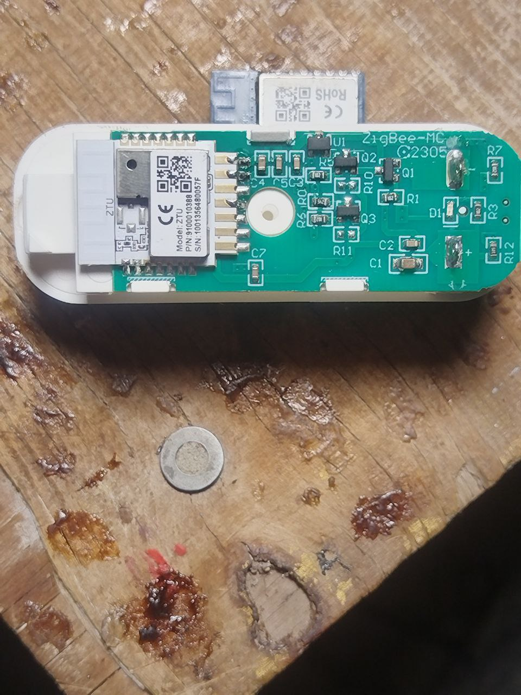

tuya-zigbee-TS0203

https://github.com/pvvx/TlsrComSwireWriter

python3 TLSR825xComFlasher.py -p /dev/ttyUSB0 -b 921600 -t 3000 rf 0 1024000 .\myOwntuya.bin  (download)

bies@debian-nout:~$ python3 TLSR825xComFlasher.py -p /dev/ttyUSB0 -b 921600 -t 70 wf 0 \myOwn1.bin  (load)

